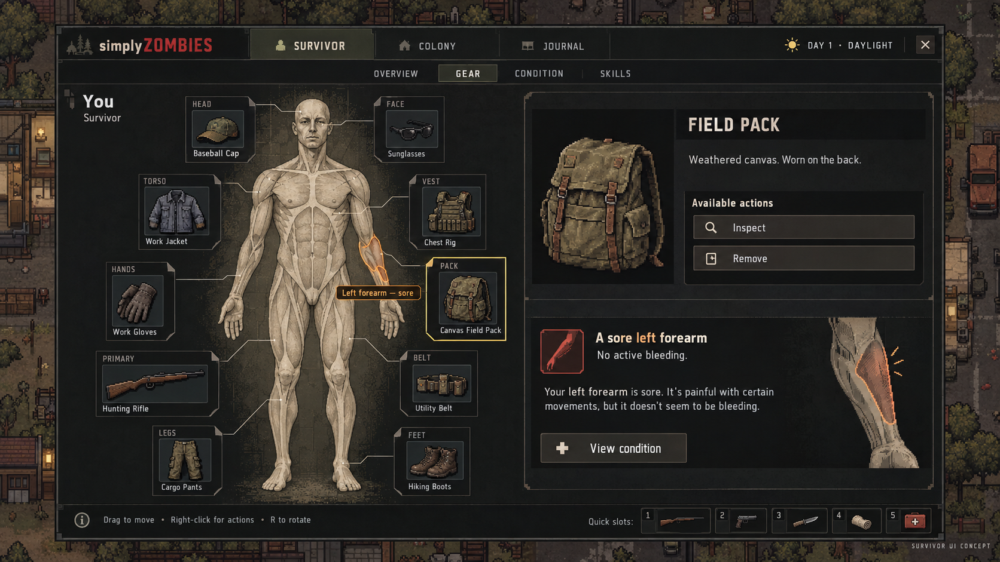

# UI overhaul evidence and concept, 2026-10-03

[The design brief](../../../docs/32-ui-overhaul.md) describes the proposal.
[The roadmap](../../../docs/23-roadmap.md#ui-overhaul) alone carries work order and status.

## Live baseline

[Audit captions and findings](audit/README.md) accompany 28 native-size screenshots of
merged main `bf6b41a`: fourteen staged live scenarios at 1280×720 and 1920×1080. These
are screenshots of real UI/read models, not naturally played campaign outcomes. The
temporary capture driver was deleted. Existing ordinary inventory, damaged chart,
title, pause and settings evidence remains in [the earlier review](../2026-10-03_ui-layout/).

## Illustrative anatomical concept

Generated with the image-generation tool for this design conversation after the owner
selected a stylized anatomical diagram with equipment arranged around it. It explores
charcoal/bone surfaces, restrained amber/moss accents and the equipment-around-anatomy
relationship. It is not a running screen, a production asset or an approved final layout.

The owner brief takes Project Zomboid's practical management as the primary reference,
Tarkov and Zero Sievert for tactical detail, and Dungeon Settlers for cohesion with the
existing world. No game screenshots or extracted third-party textures were used as
inputs to this generated concept. The shown background and item pictures are illustrative.

Corrections required in a playable layout:

- Make room for real carried bags and an opened container; the diagram and item inspector
  currently dominate the image. At 720p, use task sections and a detail drawer.
- Use only the simulation's ten body regions. The illustrated "left forearm" label and
  fine wound placement overstate the existing `arm_left` information.
- Include every one of the twelve real equipment slots and all six quick slots. The
  incomplete sets in the image are not a proposal to remove slots.
- Derive condition, treatment and protection claims from actual read models and legal
  actions. The pictured prose is not a new diagnostic guarantee.
- Validate typography, contrast and actual pixel-art integration in Godot at native size.
  Palette, type, layout and the grid-plus-fast-list recommendation remain proposals.

The anatomy image is preserved here for discussion. It must not be silently adopted as
world character art or substituted for the authored region/hit-mask assets implementation
requires.
