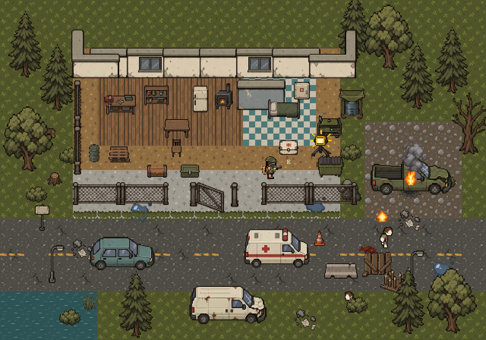

# simplyZOMBIES — Outpost asset pack 04

An original survival pixel-art set made for simplyZOMBIES, informed by the compact characters, restrained material palette and readable environments of original ZERO Sievert screenshots. This pack extends the approved survivor and shambler artwork.

Open **simplyzombies-production-preview.html** in a browser. It runs offline. Move with WASD/arrows, aim and click to fire, choose equipment, press E near containers, and use the searchable asset browser. On touch screens use the directional buttons and tap the scene. The survivor starts unequipped; every wearable and weapon remains a separate sprite.

[Complete asset catalog](previews/asset-catalog.png) ·
[Animated scene](previews/simplyzombies-production-preview.gif) ·
[Animated effects](previews/simplyzombies-effects-preview.gif)

## Included

| Group | Asset entries | Contents |
|---|---:|---|
| Environment | 33 | 12 terrain tiles, 8 ground overlays, 13 wall/fence/door/window states |
| Nature and props | 33 | 8 nature sprites, 16 furnishings/street props, 9 container states |
| Inventory and weapons | 60 | 48 inventory icons, 12 separately held weapons with grip/muzzle coordinates |
| Effects and decals | 20 | 12 four-frame effects, 8 static decals |
| Vehicles, utilities and UI | 35 | 8 vehicle states, 11 utility entries including two animations, 16 HUD icons |
| Wearables | 4 | Vest, helmet, gasmask, backpack; 16 directional overlay PNGs |
| Approved characters | 2 | Survivor and shambler, each with four idle views and four-frame walks in four directions |
| **Total** | **187** | **185 newly created asset entries plus the two approved characters** |

The standalone viewer embeds 279 native PNG files. An asset entry may contain multiple directional sprites or animation frames. Atlases, generation source sheets and contact sheets are additional files and are not counted as separate gameplay assets.

## Animation

New effects: pistol/rifle/shotgun muzzle flashes, metal sparks, concrete dust, wood splinters, blood hit, water splash, explosion, fire, smoke and ejected casing. Each has four distinct frames, playback speed, loop flag and anchor metadata. Generator running and worklamp activation add two more four-frame sequences. The two characters retain their eight directional walk sequences.

The preview triggers actual sprite frames for shots, casings, impacts and explosions, expires one-shot effects, and continuously animates fire, smoke, machinery and shamblers. Pause freezes simulation time. Doors, container lids, wrecks and barricades are discrete state swaps rather than continuous animations.

## Files

- `manifest.json` — combined registry, paths, anchors, animation metadata and example scene placements.
- `groups/` — independently usable source groups with native PNGs, atlases, source sheets, prompts, extraction scripts, manifests and inspection previews.
- `textures/characters/` — approved character idle/walk PNGs.
- `previews/` — the action GIF and catalog.
- `docs/` — import guidance, coverage inventory and asset audit.
- `viewer/` — source HTML/JavaScript and Canvas verification harness.
- `STYLE.md` — shared visual and scale contract.

All world tiles are 32×32. Characters use 32×48 canvases with ground pivot `[16,40]` and occupied height about 28px. Use nearest-neighbor filtering and integer camera scales. Per-asset dimensions and anchors are authoritative; do not infer anchors from PNG canvas centers. Main and group manifests intentionally use different relative path roots.

## Integration status and limits

This pack is checked into `godot/art/simplyzombies/` and is addressable at
`res://art/simplyzombies/`. Its generated SpriteFrames resources use that path. The live game
renderer has not yet been connected to this artwork; its existing authored/generated sprite
registry remains authoritative for shipped visuals. The HTML preview is a standalone asset
demonstration, not a Godot game capture or a reproduction of its gameplay systems.

Authoring sheets, source crops, prompts and preview renders have `.gdignore` files to keep them
out of engine import. Native textures, frames, atlases and SpriteFrames resources remain
available to the editor. The original generation prompts are provenance, not repository
instructions. No third-party reference screenshots are included.

The repository keeps all native sprites, original generation sheets and extraction scripts.
Intermediate `source-crops/` folders are omitted: those files can be reproduced by the group
extraction scripts and are not referenced by the gameplay manifest.

The gear fits the approved four standing views. It can be previewed during walking, but final per-frame deformation, hand poses and arm masking still need a character rig pass. Held weapons are static attachments; they do not include reload, bow draw or melee swing sprites. Walk bodies vary slightly in volume from idle poses.

This set covers a core outpost, world, equipment and effects slice. It does not complete every planned creature, item, building, biome or animation in the game's wider catalog. Attack/death/reload character animation, additional enemy classes, weather, full tile adjacency rules, collision polygons and engine integration remain future work. Some generated paired states vary slightly in wear or perspective. Sources use true transparency but are not restricted to a formal indexed palette.

## Validation

Every embedded image decodes; all frame rectangles stay in bounds; each animation sequence changes visible pixels. The emitted HTML runtime was exercised with a real Canvas renderer and DOM event shims. Checks cover movement and idle, aim and weapon pivots, gear toggles, one-shot lifetime, pause, containers, search filters and touch controls. See `previews/runtime-verification.json` and `docs/asset-audit.json` for detailed results.

All 20 generated SpriteFrames resources and their textures were imported and loaded in a
temporary Godot 4.7.1 project (`OUTPOST_RESOURCES_OK`). This verifies import paths and resource
contents, not integration into gameplay. The CSS layout has not been tested in a full browser.

## Reference provenance

Reference screenshots were reviewed for visual direction only. They are not shipped as usable game art and no ZERO Sievert sprites were extracted.

- [Official ZERO Sievert Steam page](https://store.steampowered.com/app/1782120/ZERO_Sievert/)
- [Official outpost screenshot](https://shared.akamai.steamstatic.com/store_item_assets/steam/apps/1782120/ss_fea3dcd2f73aacb60d8b2b2d9a7f6a092b62cac1.1920x1080.jpg)
- [Official combat update reference](https://steamcommunity.com/games/1782120/announcements/detail/3873720583830513644)
- [Bunker screenshot reference, PC Gamer](https://www.pcgamer.com/this-top-down-shooter-is-like-stalker-as-a-roguelike/)
- [simplyZOMBIES repository](https://github.com/simplyjaytea/simplyZOMBIES)

Original raster artwork was generated for this project. Native exports use mechanical cropping, nearest-neighbor scaling and transparent padding; previews compose the actual exported sprites. Exact prompts and source sheets are retained per group.
